<p align="center">
  
</p>

<p align="center">
  
</p>

<p align="center">
  
  
  
</p>

---

### 🎮 PLAYER STATUS

```

╔══════════════════════════════════════╗
║  NAME   : LuSiNa03                    ║
║  CLASS  : Software Developer          ║
║  HP     : ████████████████ 100%       ║
║  MANA   : ██████████░░░░░░  60%       ║
║  QUEST  : Building cool stuff 🚀      ║
╚══════════════════════════════════════╝

```

---

### 🕹️ SKILL TREE (Tech Stack)

<p align="left">
  
</p>

> Kalau ada icon yang masih broken pas dibuka di GitHub, biasanya cache dari skillicons.dev — coba refresh (Ctrl+Shift+R) atau tunggu beberapa menit.

---

### 📊 GAME STATS

<p align="center">
  
  
</p>

<p align="center">
  
</p>

---

### 🐍 CONTRIBUTION SNAKE GAME

<p align="center">
  
</p>

> Ular ini akan "memakan" kotak-kotak kontribusi GitHub-mu secara otomatis, gerak setiap hari lewat GitHub Actions.
>
> ⚠️ **Gambar ini baru muncul SETELAH** kamu meng-upload `.github/workflows/snake.yml` ke repo dan menjalankan Action-nya minimal 1x (lihat instruksi di bawah). Sebelum itu dijalankan, branch `output` belum ada sehingga gambarnya pasti broken.

---

### 🏆 TROPHIES

<p align="center">
  
</p>

---

### 🔗 CONNECT

<p align="center">
  <a href="https://github.com/LuSiNa03"></a>
</p>

<p align="center">
  
</p>
